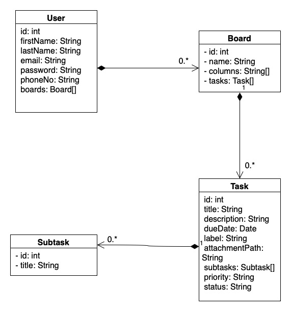

<!--  -->
# Kanban Board Project

## Description
The Kanban Board application is designed to streamline task management and enhance team collaboration. By offering a visual representation of tasks categorized into columns like "To Do," "In Progress," "Review," and "Done," it provides a clear overview of the project's workflow. Each team member can effortlessly create, prioritize, and track tasks, fostering transparency and efficiency within the team.

### Key Features
- **Task Management**: Create, assign, and categorize tasks into different columns for efficient tracking.
- **Collaboration**: Facilitate team collaboration by allowing members to join you board.
- **Drag-and-Drop Interface**: Easily move tasks across different stages using an intuitive interface.
- **User Permissions**: Role-based access control to manage user privileges within the application.
- **Analytics and Insights**: Gain valuable insights into project progress, task completion rates, team performance metrics, and bottlenecks through comprehensive analytics.
- **Internationalization**: Available in 130+ Languages.

### Analytics and Insights
The Kanban Board goes beyond task management by providing robust analytics and insights, empowering teams with valuable information to optimize their workflow:

#### Task Completion Rates
- **Visual Representation**: Graphical representation of completed tasks over time, enabling a quick grasp of productivity trends.
- **Custom Time Frames**: Analyze task completion rates for specific periods to identify patterns and productivity spikes.

#### Team Performance Metrics
- **Individual Contribution Analysis**: Track and compare individual team members' task completion rates and contributions.
- **Average Task Lifecycle**: Determine the average time taken for tasks to move through different stages, aiding in identifying potential workflow bottlenecks.

#### Project Progress Overview
- **Overall Project Status**: Overview of tasks across columns, providing a snapshot of the project's progress.
- **Identifying Delays**: Highlight tasks that have been stagnant in a particular stage for an extended period, helping teams identify potential roadblocks.

### High-Level System Design  s
The Kanban Board system follows a modular architecture to ensure scalability and maintainability. Here's a high-level overview:

#### Components:
- **Frontend Application**: Provides a user interface for task management and visualization.
- **Backend Server**: Manages data storage, user authentication, and communication between the frontend and database.
- **Database**: Stores task details, user information, and project-related data.

#### Object Model:
<!--Image insert-->

## Team Members
- Shashwat Shahi - shahi.sh@northeastern.edu
- Tejashree Gore - gore.te@northeastern.edu
- Sarvesh Sawant - sawant.sar@northeastern.edu
- Yesha Joshi - - joshi.ye@northeastern.edu

## Features
- Create and manage tasks with titles, descriptions, due dates and subtasks.
- Drag-and-drop functionality for easy task movement across columns.
- Task prioritization and status updates.
- User authentication and access control.
- Internationalization: Available in 130+ Languages.
- Collaboration: Share your board with another user.
- Analytics: Interactive interface for viewing analytics on task's status.

## Technologies Used
- Frontend: React.js, Redux, Tailwind
- Backend: Express, Node.js, Mongoose
- Database: MongoDB
- Authentication: Firebase
<!-- - Authentication: [Specify Authentication Method]
- Hosting: [Specify Hosting Platform] -->

## Setup Instructions
1. Clone the repository.
2. Install dependencies for frontend and backend.
3. Configure database settings.
4. Start the application.

<!-- ## Usage
- TBD -->

<!-- ## Contribution Guidelines
- Fork the repository.
- Create a new branch for feature/bug-fix.
- Make changes and test thoroughly.
- Submit a pull request with a descriptive title and details. -->

<!-- ## Acknowledgements
- Mention any external resources, tutorials, or libraries used. -->

<!-- ## License
[Specify the project's license information.] -->

